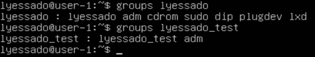
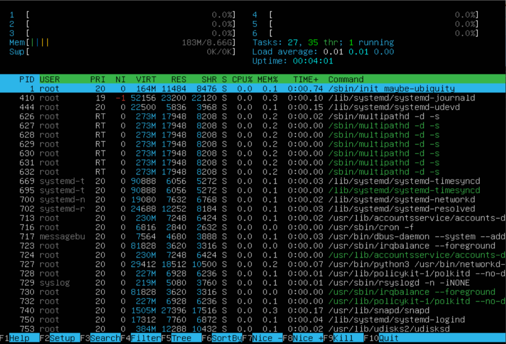
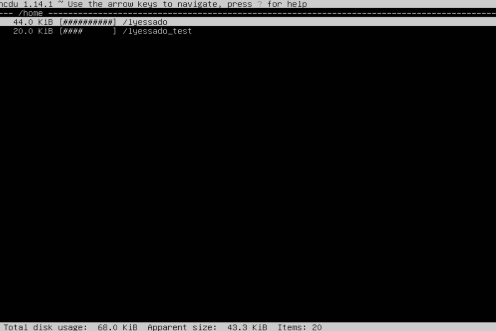
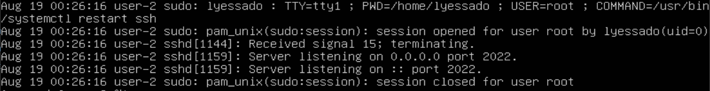

## Part 1. Установка ОС  
- Версия Ubuntu:  
  
## Part 2. Создание пользователя  
- Вызов команды для создания пользователя:  
  
- Вывод команды cat /etc/passwd:  
   
- Вывод группы adm:  

## Part 3. Настройка сети ОС  
- Установка названия машины вида user-1:  
  
- Список доступных временных зон:  
  
- Установка выбранной временной зоны с помощью команды timedatectl:  
  
- Вывод названия сетевых интерфейсов с помощью консольной команды:  
  
**Интерфейс `lo` (Loopback)**  

`lo` (loopback device) – виртуальный интерфейс, присутствующий по умолчанию в любом Linux. Он используется для отладки сетевых программ и запуска серверных приложений на локальной машине. С этим интерфейсом всегда связан адрес `127.0.0.1`. У него есть dns-имя – `localhost`.   
**Использование:**  
 _Тестирование:_  
  Позволяет проверять работу сетевых приложений и сервисов без необходимости подключения к внешним сетям.  
_Проверка соединения:_  
   Команда `ping 127.0.0.1` помогает проверить работоспособность интерфейса.  
_Настройка приложений:_  
Приложения могут использовать `localhost` для связи на одной машине.  

- ip адрес устройства от DHCP-сервера:  
  
DHCP (Dynamic Host Configuration Protocol) — это сетевой протокол, который позволяет сетевым устройствам автоматически получать IP-адрес и другие параметры, необходимые для работы в сети TCP/IP.  
Протокол работает по модели «клиент-сервер». Для автоматической конфигурации компьютер-клиент обращается к серверу DHCP и получает от него нужные параметры.  

- Внешний ip-адрес шлюза (ip):  
  
- Внутренний IP-адрес шлюза:  
  

- Установка статичных настроек ip, gw, dns.  
  Редактируем файл /etc/netplan/00-installer-config.yaml:  
  
Применяем изменения:  
  
Пинг удаленных хостов 1.1.1.1 и ya.ru:  
  
## Part 4. Обновление ОС  
- Обновление списка пакетов: `sudo apt update`  
- Обновление пакетов до последних версий: `sudo apt upgrade`  
- Проверка отсутствия обновлений: `sudo apt update`:  
  
## Part 5. Использование команды sudo  
- Убедимся что пользователь `lyessado_test` не состоит в группе sudo

- Добавление пользователя в группу sudo - `sudo usermod -aG sudo balsamis`:  
  

- _Назначение команды sudo_  
Команда sudo (от superuser do) используется для выполнения команд от имени суперпользователя (root) или другого пользователя с повышенными привилегиями. Это позволяет обычным пользователям выполнять административные задачи без необходимости входа в систему под учетной записью root. Команда sudo обеспечивает повышенную безопасность, так как администратор может точно определить, какие пользователи могут выполнять привилегированные действия, а также вести журнал выполнения таких команд.

- Изменение имени хоста:  

## Part 6. Установка и настройка службы времени
- `timedatectl show`:  

## Part 7. Установка и использование текстовых редакторов  
- Создание файлов в трёх редакторах - VIM, NANO, JOE.  

*vim:*   
  
Для выхода и сохранения необходимо нажать `Esc`, далее ввести команду `wq` и нажать `Enter`.  

*nano:*  
  
Для выхода и сохранения необходимо нажать `ctrl + x`, далее ввести `y` и нажать `Enter`.  

*mcedit:*  
  
Для выхода и сохранения необходимо нажать `F10` и выбрать `yes`. 

---
- Редактирование и выход без сохранения:  

*vim:*  
  
Для выхода без сохранения необходимо нажать `Esc`, далее ввести команду `q!` и нажать `Enter`. Проверим то, что изменения не сохранились.
  

*nano:*  
  
Для выхода без сохранения необходимо нажать `ctrl + x`, далее `n`. Проверим то, что изменения не сохранились.

*mcedit:*  
  
Для выхода без сохранения нужно нажать `F10`, затем выбрать `No`. Проверим то, что изменения не сохранились.

---
- Поиск:  

*vim:*  
  
поиск осуществляется после ввода в командном режиме `/`  

*nano:*  
  
поиск осуществляется после нажатия комбинации клавиш `ctrl + w`  

*mcedit:*  
  
поиск осуществляется после нажатия `F7` 

---
- Замена:  

*vim:*  
  
В Vim можно найти и заменить текст с помощью команды `:%s/<change_this>/<to_this>`.  

*nano:*  
  
Замена осуществляется после нажатия комбинации клавиш `ctrl + \`. 

*mcedit:*  
  
Замена осуществляется после нажатия `F4` . 

## Part 8. Установка и базовая настройка сервиса SSHD  
- Установка службы SSHd: `sudo apt update`, `sudo apt install openssh-server`  

- Добавление службы SSHd в автозагрузку: `sudo systemctl enable ssh`  

- Перенастройка службы SSHd на порт 2022:  
Открываем файл конфигурации `sshd`: `sudo nano /etc/ssh/sshd_config`  
Заменяем `#Port 22` на `Port 2022`:  
  
Сохраняем изменения и перезапускаем службу SSHd для применения настроек: `sudo systemctl restart ssh`  
- **Проверка наличия процесса SSHd:**  
  
`ps:` показывает список процессов.  
`ax:` будут показаны все процессы подробно.  
`u:` выводит пользователя и еще доп информацию.  
`grep -i sshd:` фильтрует список процессов и отображает только те, которые содержат в не зависимости от регистра `sshd`.  

- **Проверка порта и вывод команды netstat:**  
  
**Объяснение команды** `netstat -tan`  
`-t:` выводит только соединения TCP.  
`-a:` отображает все активные соединения и порты, которые ожидают подключений.  
`-n:` выводит IP-адреса и номера портов в числовом формате без попыток резолвинга в имена хостов.  
**Объяснение столбцов в выводе команды** `netstat -tan`  
`tcp:` Протокол, используемый для соединения (TCP).  
`0:` Количество байтов в очереди отправки.  
`0:` Количество байтов в очереди приема.  
`0.0.0.0:2022:` IP-адрес и порт, на которых служба слушает подключения. 0.0.0.0 означает, что служба слушает на всех доступных интерфейсах.  
`0.0.0.0:*:` IP-адрес и порт для удалённого подключения. * означает, что разрешены подключения с любых IP-адресов.  
`LISTEN:` Состояние сокета, который ожидает входящих соединений.

## Part 9. Установка и использование утилит top, htop
- Утилита top обычно установлена по умолчанию в Ubuntu.  
- Установка htop: `sudo apt update`, `sudo apt install htop`

- **Вывод команды top**:  
  
**Uptime**: `23:53:07`  
**Количество авторизованных пользователей**: `1`  
**Средняя загрузка системы**:`0.01, 0.00, 0.00`   
**Общее количество процессов**: `144`  
**Загрузка CPU**: `0.0`
**Загрузка памяти**:  
`MiB Mem 8869.0 total, 8314.6 free, 181.4 used, 373.0 buff/cache`  
`MiB Swap: 0.0 total, 0.0 free, 0.0 used. 8438.6 avail Mem`  
**PID процесса, занимающего больше всего памяти**: `1`  
**PID процесса, занимающего больше всего процессорного времени**: `19`  

- **Работа с htop**
**По PID**: Нажмите F6 (сортировка), выберите PID:  
  
**По PERCENT_CPU:**  
  
**По PERCENT_MEM**  
  
**По TIME:**  
  
**Фильтрация для процесса sshd:**  
  
**Поиск процесса syslog:**  
  
**Добавленный вывод hostname, clock и uptime:**  

## Part 10. Использование утилиты fdisk
- Название диска: `/dev/sda`
- Размер диска: `25 GiB`
- Количество секторов: `52428800`
- Swap: `512 bytes`  
Вывод команды `fdisk -l`:  
  

## Part 11. Использование утилиты df  
- **Данные для корневого раздела df (/):**   
размер раздела - `11758760`  
размер занятого пространства - `2555948`  
размер свободного пространства - `8583704`  
процент использования - `23%`  
По умолчанию единицей измерения для команды df является блок размером `1 КБ (1024 байта)`.  
**Вывод команды `df`:**  
  

- **Команда df -Th**  
размер раздела - `12G`  
размер занятого пространства - `2.5G`  
размер свободного пространства - `8.2G`  
процент использования - `23%`  
тип файловой системы - `ext4`  

`-T:` Этот параметр добавляет столбец с типом файловой системы, например ext4, tmpfs, xfs и т. д.

`-h:` Флаг, который выводит размеры в удобочитаемом формате (human-readable), преобразовывая значения в килобайты (K), мегабайты (M), гигабайты (G) и т. д., вместо блоков по 1 КБ.  
**Вывод команды** `df -Th`:  
  

## Part 12. Использование утилиты du  
- `du`:  
  
- /home, /var, /var/log в байтах:  
 

  
- /home, /var, /var/log в человекочитаемом виде:  
  
  
 
- Всё содержимое в /var/log:  
  
`-h:` Отображает размер в удобочитаемом формате (К, М, Г).  

## Part 13. Установка и использование утилиты ncdu
- Установка ncdu - `sudo apt install ncdu`  
- `/home`  
  
- `/var`  
  
- `/var/log`
  

## Part 14. Работа с системными журналами
1. /var/log/dmesg  
  
2. /var/log/syslog  
  
3. /var/log/auth.log  
  
- время последней успешной авторизации  `Aug 19 00:20:28`  
- имя пользователя  `lyessado`  
- метод входа в систему `systemd-logind`  
  

- cообщение о рестарте службы `SSHd`:  
  

## Part 15. Использование планировщика заданий CRON  
- редактор crontab: `crontab -e`

- задание, чтобы команда uptime выполнялась каждые 2 минуты: `*/2 * * * * /usr/bin/uptime`  
Вывод журнала с выполнением uptime:  
  
- текущие задания - `crontab -l`:  
  
- удалить все задания - `crontab -r`  
- вывод текущих заданий после удаления:  
  